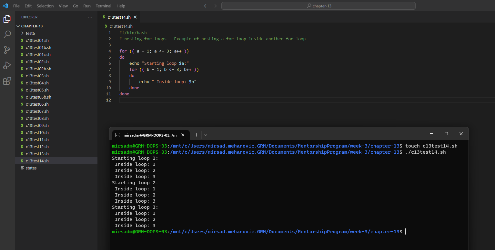
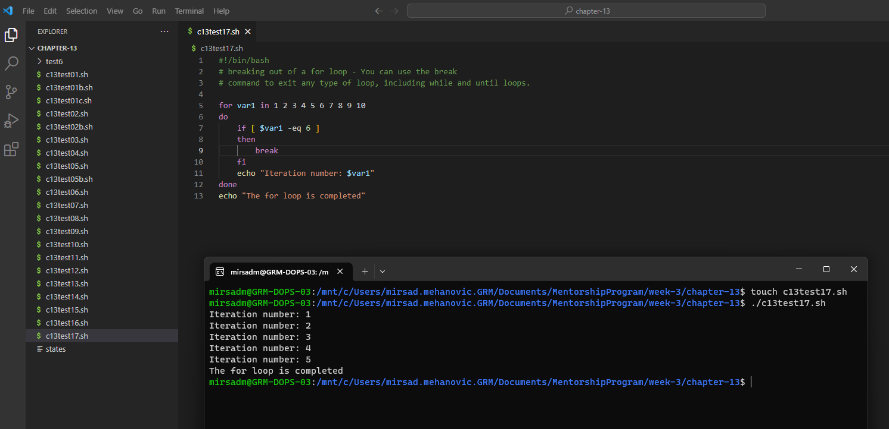
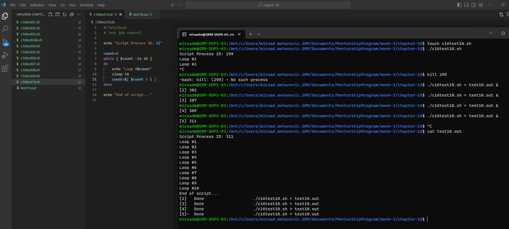

# TASK-3: Bash / Shell scripting
Week-3 was a practice for bash / shell scripting, instruction were followed from the book Linux Command Line and Shell Scripting Bible, 3rd Edition.
Please note how I'll not explain each step and actions for each command, nor will I disclose images from the book itself.
Purpose for this task is only to practice bash scripting.

Please find the book online and follow the evidence I've posted below under chapters covered from the book. This will help you visualize the actions needed to create && run each test task from the book. I've left some pointers on the images and as a comment in the .sh files to some specifics about bad use cases, etc, which might help you out.

### _For the reviewers, .sh files are stored in chapter-1* directories and it's respective screenshot/evidence or execution is stored in directory script_execution_evidence/chapter-1*. For your convenience I've taken a screenshow of both the .sh file and execution through terminal. Screenshots/evidence is posted below under each respective chapter_.


----------------------------------------------------------------------------------

# Content
## 1 [Chapter 13](#chapter-13)
## 2 [Chapter 14](#chapter-14)
## 3 [Chapter 15](#chapter-15)
## 4 [Chapter 16](#chapter-16)
## 5 [Bonus Part](#Bonus-Part)
 
 
----------------------------------------------------------------------------------
# Script execution/evidence:
## Chapter 13
Following are the tasks/test example from the chapter 13:

Test1


Test1b


Test1c


Test2


Test2b


Test3


Test4


Test5


Test5b


Test6


Test7


Test8


Test9


Test10


Test11


Test12


Test13


Test14


Test15


Test16


Test17


Test18


Test19


Test20


Test21


Test21b


Test22


Test23


Test24


Test25


Test26


## Chapter 14

Following are the tasks/test example from the chapter 14:

Test01


Test02


Test03


Test04


Test05


Test05b


Test06


Test07


Test08


Test09


Test09b


Test10


Test11


Test12


Test13


Test14


Test15


Test16


Test17


Test18


Test19


Test20


Test21


Test22


Test23


Test24


Test25


Test26


Test27


Test28

## Chapter 15

Following are the tasks/test example from the chapter 15:

Badtest


Test08


Test10


Test11


Test12


Test13


Test14


Test15


Test16


Test17


Test18


Test19


Test20


Test21


Test22


Test23


## Chapter 16

Following are the tasks/test example from the chapter 16:

Test01


Test02


Test03


Test03b


Test04


Test05


Test06-09


Test10


Test13


Test13b


## Bonus-Part

I figured it's going to be a real hustle to list down all images in markdown file with the format  so I've decided to create a bash script that going to produce a text for me that I'm only going to copy paste into this markdown file

```sh
#!/bin/bash
# Set the directory containing the images
src_folder="/mnt/c/Users/mirsad.mehanovic.GRM/Documents/MentorshipProgram/week-3/script_execution_evidence/chapter-16/"

# Loop through all the images in the directory
for image in $src_folder/*.png; do
  # Get the filename without the extension
  filename=$(basename "$image" .png)
  # Get the filename without the chapter prefix, eq c13, c14, c15, c16
  # I've decided to name my .sh and evidence with prefix of the chapter and I've only relized hows I've made my life that much harder than just using test**.sh so I had to figure out how to remove it and found that this:   "3" marks number of characters to remove.
  alt_text=${filename:3}
  # Generate the Markdown code for the image with title for the each image and alt text

  # with ^ I've managed to get the 1 capital leter from the alt_text
  title=${alt_text^}
  echo $title
  echo ""
  # Added another echo to print out another row so styling doesn't get messed up in .md file
  echo
done
```

